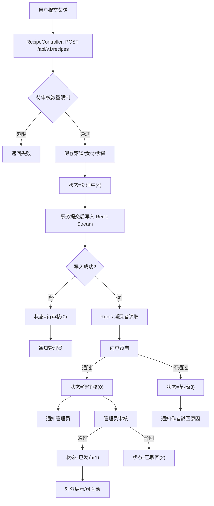
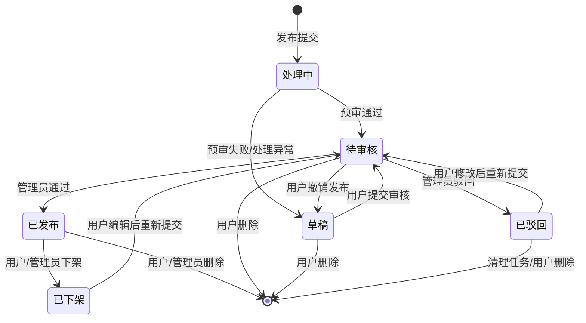

# 菜谱核心业务逻辑说明

本文聚焦菜谱发布流转的关键业务逻辑，覆盖前后端入口、状态变化、Redis 生产者/消费者模型、过滤与审核机制，并给出流程图与流转图。

## 1. 前后端入口与分工

### 前端（recipe-ui）
- 发布与编辑入口：`recipe-ui/src/views/CreateRecipeView.vue`  
  - 新建调用 `POST /api/v1/recipes`，编辑调用 `PUT /api/v1/recipes`。
- 我的菜谱与状态操作：`recipe-ui/src/views/ProfileView.vue`  
  - 加载我的菜谱使用 `GET /api/v1/recipes/list?authorId=...`。
  - 已发布可下架、待审核/处理中可撤销、非发布状态可编辑。
- 管理员审核入口：`recipe-ui/src/views/admin/RecipeManageView.vue`  
  - 审核通过/驳回调用 `POST /api/v1/admin/recipes/audit`。
  - 批量上架/下架调用 `PUT /api/v1/admin/recipes/batch/status`。
- API 封装：`recipe-ui/src/api/recipe.js` 与 `recipe-ui/src/api/admin.js`。

### 后端（recipe-platform）
- 用户端菜谱接口：`recipe-platform/recipe-web/src/main/java/com/n1etzsch3/recipe/web/controller/RecipeController.java`
  - 发布、更新、下架、撤销、删除、列表、详情等。
  - 发布接口带 `@Idempotent` 与 `@RateLimit`（限流、幂等保护）。
- 管理端审核接口：`recipe-platform/recipe-web/src/main/java/com/n1etzsch3/recipe/web/controller/AdminController.java`
  - 审核、批量审核、批量状态更新。
- 核心业务：  
  - 发布与更新：`recipe-platform/recipe-business/src/main/java/com/n1etzsch3/recipe/business/service/impl/RecipeServiceImpl.java`
  - 审核：`recipe-platform/recipe-business/src/main/java/com/n1etzsch3/recipe/business/service/impl/AdminRecipeServiceImpl.java`
  - 内容预审：`recipe-platform/recipe-business/src/main/java/com/n1etzsch3/recipe/business/service/impl/ContentValidatorImpl.java`
  - Redis 消费者：`recipe-platform/recipe-business/src/main/java/com/n1etzsch3/recipe/business/consumer/RecipeQueueConsumer.java`

## 2. 状态定义（RecipeConstants）

来源：`recipe-platform/recipe-common/src/main/java/com/n1etzsch3/recipe/common/constant/RecipeConstants.java`

| 状态码 | 含义 | 说明 |
| --- | --- | --- |
| 0 | 待审核 | 预审通过后等待管理员审核 |
| 1 | 已发布 | 管理员审核通过后可对外展示 |
| 2 | 已驳回 | 管理员审核不通过 |
| 3 | 草稿 | 用户撤销或预审失败后回退 |
| 4 | 处理中 | 发布入库后进入队列处理阶段 |
| 5 | 已下架 | 用户/管理员主动下架 |

## 3. 菜谱发布与审核核心流程

### 3.1 发布（用户）
入口：`POST /api/v1/recipes`

核心步骤（`RecipeServiceImpl.publishRecipe`）：
1. 登录校验与待审核数量限制（`MAX_PENDING_RECIPES`）。
2. 保存菜谱主表、食材、步骤；状态置为 **处理中(4)**。
3. 事务提交后写入 Redis Stream 队列（发布消息包含 recipeId/userId/timestamp）。
4. 队列写入失败时回退：状态改为 **待审核(0)** 并通知管理员。

### 3.2 Redis 预审（异步）
入口：`RecipeQueueConsumer`

核心步骤：
1. 消费 Redis Stream（消费者组 `recipe-processor-group`）。
2. 只处理 **处理中(4)** 的菜谱。
3. 调用 `ContentValidatorImpl` 做敏感词/外链过滤。
4. 预审通过：状态改为 **待审核(0)**，通知管理员。
5. 预审不通过：状态改为 **草稿(3)**，写入驳回原因并通知用户。
6. 处理异常兜底：回退草稿并提示系统异常。

### 3.3 管理员审核（人工）
入口：`POST /api/v1/admin/recipes/audit`

核心步骤（`AdminRecipeServiceImpl.auditRecipe`）：
- `pass`：状态改为 **已发布(1)**，通知作者审核通过。
- `reject`：状态改为 **已驳回(2)**，写入原因并通知作者。

### 3.4 其他状态变更
来源：`RecipeServiceImpl`
- 更新菜谱：**非已发布** 状态可编辑，更新后置为 **待审核(0)** 并通知管理员。
- 下架菜谱：**已发布(1)** → **已下架(5)**。
- 撤销发布：**待审核(0)/处理中(4)** → **草稿(3)**。
- 删除菜谱：用户/管理员均可删除；待审核状态删除会通知管理员移除。

## 4. 过滤机制

### 4.1 内容过滤（预审）
来源：`ContentValidatorImpl`
- 敏感词检测（示例词库）。
- URL 检测（禁止外链）。
- 覆盖标题、简介、步骤描述等字段。

### 4.2 展示与访问过滤
来源：`RecipeServiceImpl.getRecipeDetail`
- 未发布状态仅作者或管理员可见。
- 普通用户访问未发布状态返回“菜谱不存在”。

### 4.3 列表查询过滤
来源：`RecipeServiceImpl.pageRecipes`
- 默认仅返回 **已发布(1)**。
- 传 `authorId` 或 `status` 可查看指定状态（用于“我的菜谱”或管理员场景）。
- 支持分类、关键词、排序（最新/最热）。

### 4.4 互动限制
来源：`InteractionServiceImpl`
- 收藏、评论仅允许 **已发布(1)** 菜谱。

## 5. Redis 生产者/消费者模型

### 5.1 生产者（发布入队）
来源：`RecipeServiceImpl.publishRecipe`
- Stream Key：`recipe:stream:recipe:publish`
- 在事务提交后写入队列，避免写入未提交的脏数据。

### 5.2 消费者（队列处理）
来源：`RecipeQueueConsumer`
- 消费者组：`recipe-processor-group`，消费者名：`worker-1`。
- 每秒轮询，最多读取 5 条消息，阻塞 500ms。
- 处理后 **ACK + DELETE**，避免积压。

## 6. 业务逻辑流程图

## 7. 菜谱流转图

## 8. 关键业务特性小结
- 发布后进入 **异步预审** 阶段，避免主流程阻塞。
- 预审 + 管理员审核形成 **双层过滤**。
- 未发布菜谱默认不可被普通用户访问与互动。
- 通过状态机与限制条件保证流转可控（下架、撤销、编辑后再审）。
