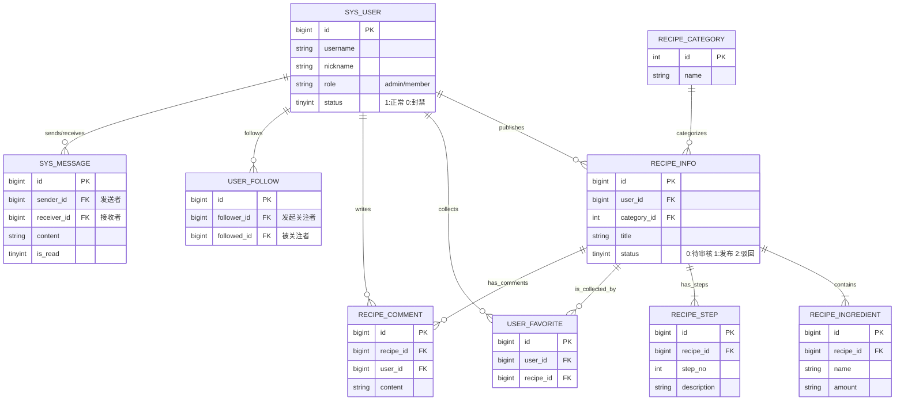

# 网上菜谱分享平台数据库设计文档

## 📘 1. 数据库概览

- **数据库名**: `db_recipe_share`
- **字符集**: `utf8mb4` (支持 Emoji 表情，适用于评论和聊天)
- **排序规则**: `utf8mb4_unicode_ci`
- **设计依据**:
  - 基于项目文档中的三种角色：游客、登录用户、管理员。
  - 基于 API 文档中的核心模块：用户、菜谱、互动、社交、后台管理。

## 🗺️ 2. 实体关系图 (ER 简述)

为了满足业务逻辑，主要包含以下实体关系：

1. **用户 (User)**: 核心实体，关联发布菜谱、评论、收藏、关注、消息。
2. **菜谱 (Recipe)**: 核心资产，包含基本信息、多个步骤、多个用料。
   - **一对多**: 一个菜谱包含多个用料 (`Ingredient`)。
   - **一对多**: 一个菜谱包含多个步骤 (`Step`)。
   - **多对一**: 菜谱属于一个分类 (`Category`)。
3. **互动 (Interaction)**:
   - **收藏**: 多对多（用户 <-> 菜谱）。
   - **评论**: 一对多（用户 -> 评论 -> 菜谱）。
   - **关注**: 多对多（用户 <-> 用户）。
   - **消息**: 一对一（用户 -> 消息 -> 用户）。
4. **ER图：**




------

## 🗂️ 3. 数据表详细设计

### 3.1 用户管理模块

#### 表名：`sys_user` (用户表)

用于存储管理员和普通用户的信息。

| 字段名        | 类型     | 长度 | 必填 | 说明                    | 对应 API 字段 |
| ------------- | -------- | ---- | ---- | ----------------------- | ------------- |
| `id`          | BIGINT   | 20   | ✅    | 主键，自增              | `userId`      |
| `username`    | VARCHAR  | 50   | ✅    | 登录账号，唯一索引      | `username`    |
| `password`    | VARCHAR  | 100  | ✅    | 加密后的密码 (BCrypt)   | -             |
| `nickname`    | VARCHAR  | 50   | ✅    | 用户昵称                | `nickname`    |
| `avatar`      | VARCHAR  | 255  | ❌    | 头像 URL                | `avatar`      |
| `intro`       | VARCHAR  | 200  | ❌    | 个人简介                | `intro`       |
| `role`        | VARCHAR  | 20   | ✅    | 角色：`admin`, `member` | `role`        |
| `status`      | TINYINT  | 1    | ✅    | 状态：1-正常, 0-封禁    | -             |
| `create_time` | DATETIME | -    | ✅    | 注册时间                | -             |
| `update_time` | DATETIME | -    | ✅    | 更新时间                | -             |

> **设计备注**: 对应 API `POST /api/v1/users/register` 和 `PUT /api/v1/users/me`。

------

### 3.2 菜谱核心模块

#### 表名：`recipe_category` (菜谱分类表)

| 字段名        | 类型     | 长度 | 必填 | 说明                      | 对应 API 字段 |
| ------------- | -------- | ---- | ---- | ------------------------- | ------------- |
| `id`          | INT      | 11   | ✅    | 主键，自增                | `categoryId`  |
| `name`        | VARCHAR  | 50   | ✅    | 分类名称 (如: 川菜, 甜点) | `name`        |
| `sort_order`  | INT      | 4    | ❌    | 排序优先级                | `sortOrder`   |
| `create_time` | DATETIME | -    | ✅    | 创建时间                  | -             |


#### 表名：`recipe_info` (菜谱主表)

存储菜谱的基础信息和审核状态。

| 字段名          | 类型     | 长度 | 必填 | 说明                                 | 对应 API 字段  |
| --------------- | -------- | ---- | ---- | ------------------------------------ | -------------- |
| `id`            | BIGINT   | 20   | ✅    | 主键，自增                           | `id`           |
| `title`         | VARCHAR  | 100  | ✅    | 菜谱标题                             | `title`        |
| `user_id`       | BIGINT   | 20   | ✅    | 发布者 ID (外键)                     | `author.id`    |
| `category_id`   | INT      | 11   | ✅    | 分类 ID (外键)                       | `categoryId`   |
| `cover_image`   | VARCHAR  | 255  | ✅    | 封面图 URL                           | `coverImage`   |
| `description`   | VARCHAR  | 500  | ❌    | 菜谱简介/心得                        | `description`  |
| `status`        | TINYINT  | 1    | ✅    | **状态**: 0-待审核, 1-已发布, 2-驳回 | `status`       |
| `reject_reason` | VARCHAR  | 255  | ❌    | 审核驳回原因                         | `rejectReason` |
| `view_count`    | INT      | 11   | ✅    | 浏览量，默认为 0                     | `viewCount`    |
| `create_time`   | DATETIME | -    | ✅    | 发布时间                             | `publishTime`  |
| `update_time`   | DATETIME | -    | ✅    | 更新时间                             | -              |


> **设计备注**: `status` 字段严格对应项目文档中的流转逻辑。

#### 表名：`recipe_ingredient` (菜谱用料表)

| 字段名       | 类型    | 长度 | 必填 | 说明                  | 对应 API 字段          |
| ------------ | ------- | ---- | ---- | --------------------- | ---------------------- |
| `id`         | BIGINT  | 20   | ✅    | 主键                  | -                      |
| `recipe_id`  | BIGINT  | 20   | ✅    | 关联菜谱 ID           | -                      |
| `name`       | VARCHAR | 50   | ✅    | 食材名称 (如: 豆腐)   | `ingredients[].name`   |
| `amount`     | VARCHAR | 50   | ✅    | 用量 (如: 500g, 适量) | `ingredients[].amount` |
| `sort_order` | INT     | 4    | ❌    | 排序                  | -                      |


#### 表名：`recipe_step` (菜谱步骤表)

| 字段名        | 类型    | 长度 | 必填 | 说明                  | 对应 API 字段    |
| ------------- | ------- | ---- | ---- | --------------------- | ---------------- |
| `id`          | BIGINT  | 20   | ✅    | 主键                  | -                |
| `recipe_id`   | BIGINT  | 20   | ✅    | 关联菜谱 ID           | -                |
| `step_no`     | INT     | 4    | ✅    | 步骤序号 (1, 2, 3...) | `steps[].stepNo` |
| `description` | TEXT    | -    | ✅    | 步骤文字描述          | `steps[].desc`   |
| `image_url`   | VARCHAR | 255  | ❌    | 步骤图 URL            | `steps[].img`    |


------

### 3.3 互动与社交模块

#### 表名：`user_favorite` (收藏表)

| 字段名        | 类型     | 长度 | 必填 | 说明     |
| ------------- | -------- | ---- | ---- | -------- |
| `id`          | BIGINT   | 20   | ✅    | 主键     |
| `user_id`     | BIGINT   | 20   | ✅    | 用户 ID  |
| `recipe_id`   | BIGINT   | 20   | ✅    | 菜谱 ID  |
| `create_time` | DATETIME | -    | ✅    | 收藏时间 |

 

#### 表名：`recipe_comment` (评论表)

| 字段名        | 类型     | 长度 | 必填 | 说明     | 对应 API 字段 |
| ------------- | -------- | ---- | ---- | -------- | ------------- |
| `id`          | BIGINT   | 20   | ✅    | 主键     | `commentId`   |
| `recipe_id`   | BIGINT   | 20   | ✅    | 关联菜谱 | `recipeId`    |
| `user_id`     | BIGINT   | 20   | ✅    | 评论人   | -             |
| `content`     | VARCHAR  | 500  | ✅    | 评论内容 | `content`     |
| `create_time` | DATETIME | -    | ✅    | 评论时间 | -             |

 

#### 表名：`user_follow` (关注表)

| 字段名        | 类型     | 长度 | 必填 | 说明              |
| ------------- | -------- | ---- | ---- | ----------------- |
| `id`          | BIGINT   | 20   | ✅    | 主键              |
| `follower_id` | BIGINT   | 20   | ✅    | 发起关注的人 (我) |
| `followed_id` | BIGINT   | 20   | ✅    | 被关注的人 (大厨) |
| `create_time` | DATETIME | -    | ✅    | 关注时间          |

 

#### 表名：`sys_message` (私信表)

| 字段名        | 类型     | 长度 | 必填 | 说明                 |
| ------------- | -------- | ---- | ---- | -------------------- |
| `id`          | BIGINT   | 20   | ✅    | 主键                 |
| `sender_id`   | BIGINT   | 20   | ✅    | 发送者 ID            |
| `receiver_id` | BIGINT   | 20   | ✅    | 接收者 ID            |
| `content`     | TEXT     | -    | ✅    | 私信内容             |
| `is_read`     | TINYINT  | 1    | ✅    | 状态: 0-未读, 1-已读 |
| `create_time` | DATETIME | -    | ✅    | 发送时间             |

 

> **设计备注**: 对应项目文档中的“一对一私聊”功能，配合 WebSocket 使用。

------

## 🛠️ 4. 关键 SQL 建表语句 (示例)

以下是核心表 `recipe_info` 的建表语句，展示了如何落实文档中的审核状态逻辑：

```SQL
/*
 * 网上菜谱分享平台数据库初始化脚本
 * 数据库: db_recipe_share
 * 版本: 1.0
 */

-- 1. 创建并使用数据库
CREATE DATABASE IF NOT EXISTS `db_recipe_share` DEFAULT CHARACTER SET utf8mb4 COLLATE utf8mb4_unicode_ci;
USE `db_recipe_share`;

-- ==========================================
-- 1. 用户管理模块
-- ==========================================

-- 表：sys_user (用户表)
CREATE TABLE `sys_user` (
  `id` bigint(20) NOT NULL AUTO_INCREMENT COMMENT '主键ID',
  `username` varchar(50) NOT NULL COMMENT '登录账号',
  `password` varchar(100) NOT NULL COMMENT '加密密码',
  `nickname` varchar(50) NOT NULL COMMENT '用户昵称',
  `avatar` varchar(255) DEFAULT NULL COMMENT '头像URL',
  `intro` varchar(200) DEFAULT NULL COMMENT '个人简介',
  `role` varchar(20) NOT NULL DEFAULT 'member' COMMENT '角色: admin-管理员, member-普通用户',
  `status` tinyint(1) NOT NULL DEFAULT '1' COMMENT '状态: 1-正常, 0-封禁',
  `create_time` datetime NOT NULL DEFAULT CURRENT_TIMESTAMP COMMENT '注册时间',
  `update_time` datetime NOT NULL DEFAULT CURRENT_TIMESTAMP ON UPDATE CURRENT_TIMESTAMP COMMENT '更新时间',
  PRIMARY KEY (`id`),
  UNIQUE KEY `uk_username` (`username`) USING BTREE COMMENT '账号唯一索引'
) ENGINE=InnoDB DEFAULT CHARSET=utf8mb4 COMMENT='用户信息表';


-- ==========================================
-- 2. 菜谱核心模块
-- ==========================================

-- 表：recipe_category (菜谱分类表)
CREATE TABLE `recipe_category` (
  `id` int(11) NOT NULL AUTO_INCREMENT COMMENT '主键ID',
  `name` varchar(50) NOT NULL COMMENT '分类名称',
  `sort_order` int(4) DEFAULT '0' COMMENT '排序优先级',
  `create_time` datetime NOT NULL DEFAULT CURRENT_TIMESTAMP COMMENT '创建时间',
  PRIMARY KEY (`id`)
) ENGINE=InnoDB DEFAULT CHARSET=utf8mb4 COMMENT='菜谱分类表';

-- 表：recipe_info (菜谱主表)
CREATE TABLE `recipe_info` (
  `id` bigint(20) NOT NULL AUTO_INCREMENT COMMENT '主键ID',
  `title` varchar(100) NOT NULL COMMENT '菜谱标题',
  `user_id` bigint(20) NOT NULL COMMENT '发布者ID',
  `category_id` int(11) NOT NULL COMMENT '分类ID',
  `cover_image` varchar(255) NOT NULL COMMENT '封面图URL',
  `description` varchar(500) DEFAULT NULL COMMENT '菜谱简介/心得',
  `status` tinyint(1) NOT NULL DEFAULT '0' COMMENT '状态: 0-待审核, 1-已发布, 2-驳回',
  `reject_reason` varchar(255) DEFAULT NULL COMMENT '审核驳回原因',
  `view_count` int(11) DEFAULT '0' COMMENT '浏览量',
  `create_time` datetime NOT NULL DEFAULT CURRENT_TIMESTAMP COMMENT '创建时间',
  `update_time` datetime NOT NULL DEFAULT CURRENT_TIMESTAMP ON UPDATE CURRENT_TIMESTAMP COMMENT '更新时间',
  PRIMARY KEY (`id`),
  KEY `idx_user_id` (`user_id`),
  KEY `idx_category_id` (`category_id`),
  KEY `idx_title` (`title`) COMMENT '用于搜索'
) ENGINE=InnoDB DEFAULT CHARSET=utf8mb4 COMMENT='菜谱信息表';

-- 表：recipe_ingredient (菜谱用料表)
CREATE TABLE `recipe_ingredient` (
  `id` bigint(20) NOT NULL AUTO_INCREMENT COMMENT '主键ID',
  `recipe_id` bigint(20) NOT NULL COMMENT '关联菜谱ID',
  `name` varchar(50) NOT NULL COMMENT '食材名称',
  `amount` varchar(50) NOT NULL COMMENT '用量',
  `sort_order` int(4) DEFAULT '0' COMMENT '排序',
  PRIMARY KEY (`id`),
  KEY `idx_recipe_id` (`recipe_id`)
) ENGINE=InnoDB DEFAULT CHARSET=utf8mb4 COMMENT='菜谱用料表';

-- 表：recipe_step (菜谱步骤表)
CREATE TABLE `recipe_step` (
  `id` bigint(20) NOT NULL AUTO_INCREMENT COMMENT '主键ID',
  `recipe_id` bigint(20) NOT NULL COMMENT '关联菜谱ID',
  `step_no` int(4) NOT NULL COMMENT '步骤序号',
  `description` text NOT NULL COMMENT '步骤描述',
  `image_url` varchar(255) DEFAULT NULL COMMENT '步骤图URL',
  PRIMARY KEY (`id`),
  KEY `idx_recipe_id` (`recipe_id`)
) ENGINE=InnoDB DEFAULT CHARSET=utf8mb4 COMMENT='菜谱步骤表';


-- ==========================================
-- 3. 互动与社交模块
-- ==========================================

-- 表：user_favorite (用户收藏表)
CREATE TABLE `user_favorite` (
  `id` bigint(20) NOT NULL AUTO_INCREMENT COMMENT '主键ID',
  `user_id` bigint(20) NOT NULL COMMENT '用户ID',
  `recipe_id` bigint(20) NOT NULL COMMENT '菜谱ID',
  `create_time` datetime NOT NULL DEFAULT CURRENT_TIMESTAMP COMMENT '收藏时间',
  PRIMARY KEY (`id`),
  UNIQUE KEY `uk_user_recipe` (`user_id`,`recipe_id`) COMMENT '防止重复收藏',
  KEY `idx_user_id` (`user_id`)
) ENGINE=InnoDB DEFAULT CHARSET=utf8mb4 COMMENT='用户收藏表';

-- 表：recipe_comment (菜谱评论表)
CREATE TABLE `recipe_comment` (
  `id` bigint(20) NOT NULL AUTO_INCREMENT COMMENT '主键ID',
  `recipe_id` bigint(20) NOT NULL COMMENT '菜谱ID',
  `user_id` bigint(20) NOT NULL COMMENT '评论者ID',
  `content` varchar(500) NOT NULL COMMENT '评论内容',
  `create_time` datetime NOT NULL DEFAULT CURRENT_TIMESTAMP COMMENT '评论时间',
  PRIMARY KEY (`id`),
  KEY `idx_recipe_id` (`recipe_id`),
  KEY `idx_user_id` (`user_id`)
) ENGINE=InnoDB DEFAULT CHARSET=utf8mb4 COMMENT='菜谱评论表';

-- 表：user_follow (用户关注表)
CREATE TABLE `user_follow` (
  `id` bigint(20) NOT NULL AUTO_INCREMENT COMMENT '主键ID',
  `follower_id` bigint(20) NOT NULL COMMENT '发起关注者ID',
  `followed_id` bigint(20) NOT NULL COMMENT '被关注者ID',
  `create_time` datetime NOT NULL DEFAULT CURRENT_TIMESTAMP COMMENT '关注时间',
  PRIMARY KEY (`id`),
  UNIQUE KEY `uk_follow_relation` (`follower_id`,`followed_id`) COMMENT '防止重复关注',
  KEY `idx_follower` (`follower_id`),
  KEY `idx_followed` (`followed_id`)
) ENGINE=InnoDB DEFAULT CHARSET=utf8mb4 COMMENT='用户关注关系表';

-- 表：sys_message (私信表)
CREATE TABLE `sys_message` (
  `id` bigint(20) NOT NULL AUTO_INCREMENT COMMENT '主键ID',
  `sender_id` bigint(20) NOT NULL COMMENT '发送者ID',
  `receiver_id` bigint(20) NOT NULL COMMENT '接收者ID',
  `content` text NOT NULL COMMENT '私信内容',
  `is_read` tinyint(1) NOT NULL DEFAULT '0' COMMENT '状态: 0-未读, 1-已读',
  `create_time` datetime NOT NULL DEFAULT CURRENT_TIMESTAMP COMMENT '发送时间',
  PRIMARY KEY (`id`),
  KEY `idx_sender` (`sender_id`),
  KEY `idx_receiver` (`receiver_id`)
) ENGINE=InnoDB DEFAULT CHARSET=utf8mb4 COMMENT='站内私信表';
```

## ⚠️ 5. 设计注意事项

1. **搜索优化**: `recipe_info` 表中的 `title` 字段建议添加索引，以支持 API 文档中的 `/api/v1/recipes/search` 模糊查询。
2. **数据一致性**: 删除菜谱时，建议使用事务同时删除 `recipe_ingredient` 和 `recipe_step` 中的关联数据，或者在数据库层面设置外键级联删除 (`ON DELETE CASCADE`)。
3. **敏感字段**: `sys_user` 表中的 `password` 字段在 API 返回时必须过滤掉（DTO 转换），严禁返回给前端。
4. **私信权限**: 虽然数据库允许任意用户间发送消息，但根据项目文档逻辑，业务层代码需校验 `user_follow` 表中是否存在关注关系，才允许插入 `sys_message` 数据。