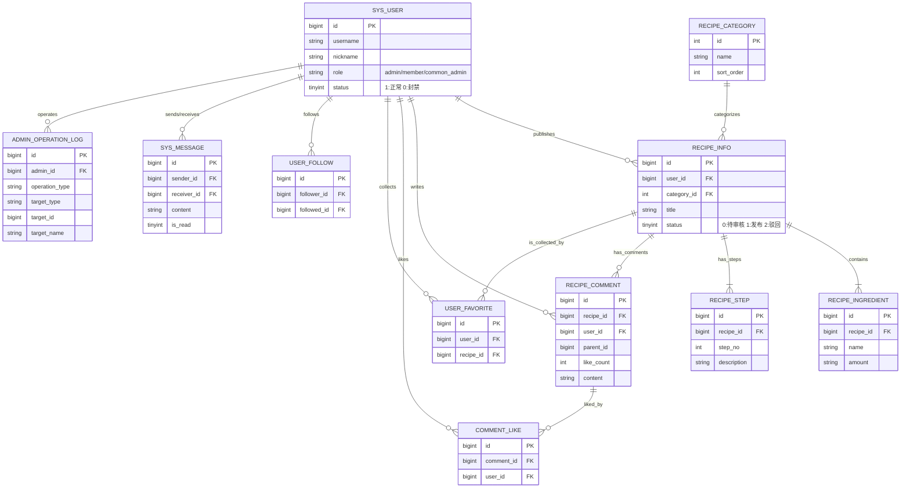

# 网上菜谱分享平台数据库设计文档

## 1. 数据库概览

- 数据库名：`recipe_platform`
- 字符集：`utf8mb4`
- 排序规则：`utf8mb4_unicode_ci`
- 设计依据：代码与 SQL 初始化脚本 `sql/recipe-platform-sql.sql`

## 2. 实体关系概述（ER 简述）

- 用户（sys_user）发布菜谱、发表评论、收藏、关注、私信。
- 菜谱（recipe_info）包含多个用料与步骤，属于某个分类。
- 评论（recipe_comment）支持父子评论，评论可被点赞（comment_like）。
- 管理员操作日志（admin_operation_log）记录后台行为。

## 3. 数据表详细设计

### 3.1 `sys_user` 用户表

| 字段 | 类型 | 必填 | 说明 |
| --- | --- | --- | --- |
| id | BIGINT | 是 | 主键，自增 |
| username | VARCHAR(50) | 是 | 登录账号，唯一 |
| password | VARCHAR(100) | 是 | 加密密码 |
| nickname | VARCHAR(50) | 是 | 昵称 |
| avatar | VARCHAR(255) | 否 | 头像 URL |
| intro | VARCHAR(200) | 否 | 个人简介 |
| role | VARCHAR(20) | 是 | 角色：admin/member/common_admin |
| status | TINYINT(1) | 是 | 1 正常，0 封禁 |
| create_time | DATETIME | 是 | 注册时间 |
| update_time | DATETIME | 是 | 更新时间 |

### 3.2 `recipe_category` 菜谱分类表

| 字段 | 类型 | 必填 | 说明 |
| --- | --- | --- | --- |
| id | INT | 是 | 主键，自增 |
| name | VARCHAR(50) | 是 | 分类名称 |
| sort_order | INT | 否 | 排序优先级 |
| create_time | DATETIME | 是 | 创建时间 |

### 3.3 `recipe_info` 菜谱主表

| 字段 | 类型 | 必填 | 说明 |
| --- | --- | --- | --- |
| id | BIGINT | 是 | 主键，自增 |
| title | VARCHAR(100) | 是 | 菜谱标题 |
| user_id | BIGINT | 是 | 作者 ID |
| category_id | INT | 是 | 分类 ID |
| cover_image | VARCHAR(255) | 是 | 封面图 URL |
| description | VARCHAR(500) | 否 | 菜谱简介 |
| status | TINYINT(1) | 是 | 0 待审核，1 已发布，2 驳回 |
| reject_reason | VARCHAR(255) | 否 | 驳回原因 |
| view_count | INT | 否 | 浏览量 |
| create_time | DATETIME | 是 | 创建时间 |
| update_time | DATETIME | 是 | 更新时间 |

### 3.4 `recipe_ingredient` 菜谱用料表

| 字段 | 类型 | 必填 | 说明 |
| --- | --- | --- | --- |
| id | BIGINT | 是 | 主键 |
| recipe_id | BIGINT | 是 | 菜谱 ID |
| name | VARCHAR(50) | 是 | 食材名称 |
| amount | VARCHAR(50) | 是 | 用量 |
| sort_order | INT | 否 | 排序 |

### 3.5 `recipe_step` 菜谱步骤表

| 字段 | 类型 | 必填 | 说明 |
| --- | --- | --- | --- |
| id | BIGINT | 是 | 主键 |
| recipe_id | BIGINT | 是 | 菜谱 ID |
| step_no | INT | 是 | 步骤序号 |
| description | TEXT | 是 | 步骤描述 |
| image_url | VARCHAR(255) | 否 | 步骤图 URL |

### 3.6 `user_favorite` 收藏表

| 字段 | 类型 | 必填 | 说明 |
| --- | --- | --- | --- |
| id | BIGINT | 是 | 主键 |
| user_id | BIGINT | 是 | 用户 ID |
| recipe_id | BIGINT | 是 | 菜谱 ID |
| create_time | DATETIME | 是 | 收藏时间 |

### 3.7 `recipe_comment` 评论表

| 字段 | 类型 | 必填 | 说明 |
| --- | --- | --- | --- |
| id | BIGINT | 是 | 主键 |
| recipe_id | BIGINT | 是 | 菜谱 ID |
| user_id | BIGINT | 是 | 评论者 ID |
| parent_id | BIGINT | 否 | 父评论 ID |
| content | VARCHAR(500) | 是 | 评论内容 |
| like_count | INT | 否 | 点赞数 |
| create_time | DATETIME | 是 | 评论时间 |

### 3.8 `comment_like` 评论点赞表

| 字段 | 类型 | 必填 | 说明 |
| --- | --- | --- | --- |
| id | BIGINT | 是 | 主键 |
| comment_id | BIGINT | 是 | 评论 ID |
| user_id | BIGINT | 是 | 点赞用户 ID |
| create_time | DATETIME | 是 | 点赞时间 |

### 3.9 `user_follow` 关注表

| 字段 | 类型 | 必填 | 说明 |
| --- | --- | --- | --- |
| id | BIGINT | 是 | 主键 |
| follower_id | BIGINT | 是 | 发起关注者 ID |
| followed_id | BIGINT | 是 | 被关注者 ID |
| create_time | DATETIME | 是 | 关注时间 |

### 3.10 `sys_message` 私信表

| 字段 | 类型 | 必填 | 说明 |
| --- | --- | --- | --- |
| id | BIGINT | 是 | 主键 |
| sender_id | BIGINT | 是 | 发送者 ID |
| receiver_id | BIGINT | 是 | 接收者 ID |
| content | TEXT | 是 | 私信内容 |
| is_read | TINYINT(1) | 是 | 0 未读，1 已读 |
| create_time | DATETIME | 是 | 发送时间 |

### 3.11 `admin_operation_log` 管理员操作日志表

| 字段 | 类型 | 必填 | 说明 |
| --- | --- | --- | --- |
| id | BIGINT | 是 | 主键 |
| admin_id | BIGINT | 是 | 管理员 ID |
| admin_name | VARCHAR(50) | 是 | 管理员用户名 |
| operation_type | VARCHAR(50) | 是 | 操作类型 |
| target_type | VARCHAR(50) | 否 | 目标类型 |
| target_id | BIGINT | 否 | 目标 ID |
| target_name | VARCHAR(100) | 否 | 目标名称 |
| detail | VARCHAR(500) | 否 | 操作详情 |
| ip_address | VARCHAR(50) | 否 | IP 地址 |
| create_time | DATETIME | 是 | 操作时间 |

## 4. 设计注意事项

1. 评论支持父子结构，`parent_id` 为空表示顶级评论。
2. 评论点赞通过 `comment_like` 去重（comment_id + user_id）。
3. 删除菜谱时需同步清理食材/步骤/评论等关联数据。
4. `sys_user.password` 禁止对外返回，仅用于后端校验。
